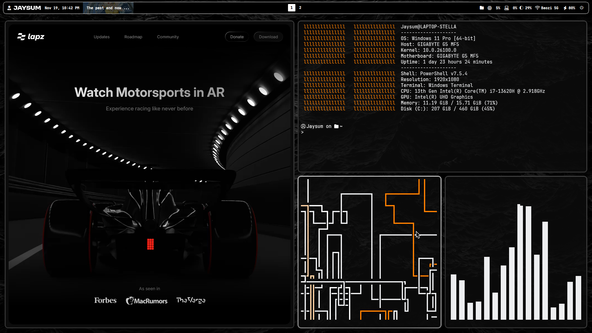

<h1 align="center">
    <a name="top" title="dotfiles">~/.&nbsp;📂</a> Jaysum's dotfiles 
</h1>

  

  

> [!WARNING]
> This dotfiles repository is still under development. 

## Prerequisites
- Windows PowerShell 7
- Git

## Installation
1. Clone the repository: `git clone https://github.com/Jaysum57/dotfiles.git`
2. Run `Setup.ps1` as administrator

## What's inside?

### 📦 Package Managers

- [Chocolatey]() - Windows package manager for simplified software management
- [Scoop]() - Command-line installer for Windows with minimalist approach
- [Winget]() - Microsoft's official Windows Package Manager

### 🎨 Desktop & UI

- [Altsnap]() - Window moving and tiling utility for Windows
- [Flow Launcher]() - Quick application launcher
- [Komorebi]() - Window management system for tiling window layouts
- [Powertoys]() - Advanced Windows productivity utilities
- [Windhawk]() - Customization tool for modifying Windows behavior
- [Yasb]() - Yet Another Status Bar for desktop customization

### 🎮 Gaming & Entertainment

- [Anki]() - Spaced repetition flashcard learning system
- [Bloxstrap]() - Bootstrap client for Roblox with enhanced features
- [Playnite]() - Game library manager and launcher
- [Stremio]() - Streaming media platform aggregator
- [Zen Browser]() - Privacy-focused web browser

### 🛠️ Utilities

- [Bitwarden CLI]() - Command-line password manager interface
- [Everything]() - Ultra-fast file search utility
- [FFMPEG]() - Multimedia processing and conversion framework
- [Geek.exe]() - System information and hardware monitoring tool
- [JDownloader2]() - Download manager for streaming platforms
- [PDF Arranger]() - PDF manipulation and reordering tool
- [Proton VPN]() - Secure VPN service client
- [Winrar]() - Archive manager for compression and extraction
- [Wiztree]() - Disk space analysis and visualization tool
- [Yt-dlp]() - Video downloader for YouTube and other platforms
- [VLC]() - Multimedia player for audio and video files

### 📝 Productivity & Content

- [Canva]() - Graphic design and content creation platform
- [Obsidian]() - Knowledge management and note-taking application

### 💻 Languages & Development

- [Git]() - Version control system for tracking code changes
- [Lua]() - Lightweight scripting language
- [Neovim]() - Modern fork of Vim text editor
- [Python]() - Versatile high-level programming language
- [Rust]() - Systems programming language focused on safety
- [VSCode]() - Feature-rich code editor by Microsoft

### 🎨 Themes

**Black**

