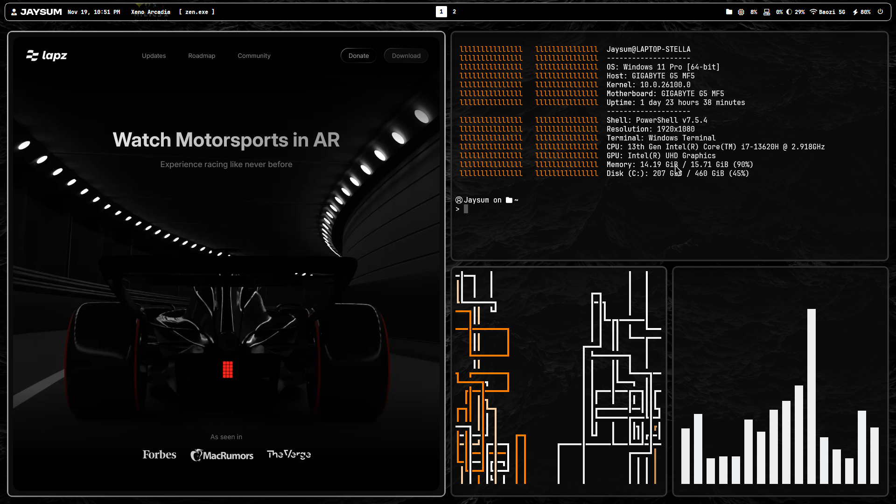

<h1 align="center">
    <a name="top" title="dotfiles">~/.&nbsp;📂</a> Jaysum's dotfiles 
</h1>

  
  

> [!WARNING]
>
> ### 🚧 Under Active Development 🚧
>
> _Expect Breaking Changes_
>
> This repository is still in its early development/refactoring phase. I am still working on major structural improvements, and changes may break backward compatibility frequently.
## Requirements

- Windows PowerShell 7
- Git

## Installation

1. Clone the repository: `git clone https://github.com/Jaysum57/dotfiles.git`
2. Run `Setup.ps1` as administrator

## 💻 System

|       App        |      Description      |
| :--------------: | :-------------------: |
|   [Windows]()    |   Operating System    |
|   [Komorebi]()   | Window Tiling Manager |
|     [YASB]()     |      Status bar       |
| [FlowLauncher]() |     App launcher      |
|     [Zen]()      |   Browser (Firefox)   |
|    [Helium]()    |  Browser (Chromium)   |

## What's inside?

### 📦 Package Managers

|      Tool      |            Description             |
| :------------: | :--------------------------------: |
| [Chocolatey]() |    Windows package manager tool    |
|   [Scoop]()    | Command-line installer for Windows |
|   [Winget]()   |  Official Windows Package Manager  |

### 🎨 Desktop & UI

|     Tool      |        Description         |
| :-----------: | :------------------------: |
|  [Altsnap]()  |   Window moving utility    |
| [Powertoys]() | Windows productivity tools |
| [Windhawk]()  |     Windows GIU Tweaks     |

### 🎮 Gaming & Entertainment

|     Tool      |             Description              |
| :-----------: | :----------------------------------: |
| [Bloxstrap]() | Roblox client with enhanced features |
| [Playnite]()  |  Game library manager and launcher   |
|  [Stremio]()  | Streaming media platform aggregator  |

### 🛠️ Utilities

|       Tool        |      Description      |
| :---------------: | :-------------------: |
| [Bitwarden CLI]() | CLI password manager  |
|  [Everything]()   |     File Indexer      |
|    [FFMPEG]()     | Multimedia processing |
|   [Geek.exe]()    |      Uninstaller      |
| [JDownloader2]()  |      Downloader       |
| [PDF Arranger]()  |   PDF manipulation    |
|  [Proton VPN]()   |          VPN          |
|    [Winrar]()     |   Compression files   |
|    [Wiztree]()    |  Disk space analyzer  |
|    [Yt-dlp]()     |   Video Downloader    |
|      [VLC]()      |     Media player      |

### 📝 Productivity

|     Tool     |       Description       |
| :----------: | :---------------------: |
|   [Anki]()   |  Spaced repetition app  |
|  [Canva]()   | Graphic design platform |
| [Obsidian]() | Note-taking application |

### 💻 Programming Languages

|    Tool    |      Description       |
| :--------: | :--------------------: |
|  [Lua]()   | Lightweight scripting  |
| [Python]() | High-level programming |
|  [Rust]()  | Safety-focused systems |

### 💻 CLI Tools

|     Tool      |    Description    |
| :-----------: | :---------------: |
|  [Neovim]()   |  Vim text editor  |
|   [yazi]()    |   File manager    |
| [ohmyposh]()  |   Shell promopt   |
|    [fzf]()    |    File finder    |
| [fastfetch]() |    System info    |
|    [bat]()    | `cat` replacement |

<!-- |  | | -->

## 🎨 Themes

|      Name      |                        Preview                         |
| :------------: | :----------------------------------------------------: |
| <h3>Black</h3> |  |

<!-- | <h3></h3> || -->
